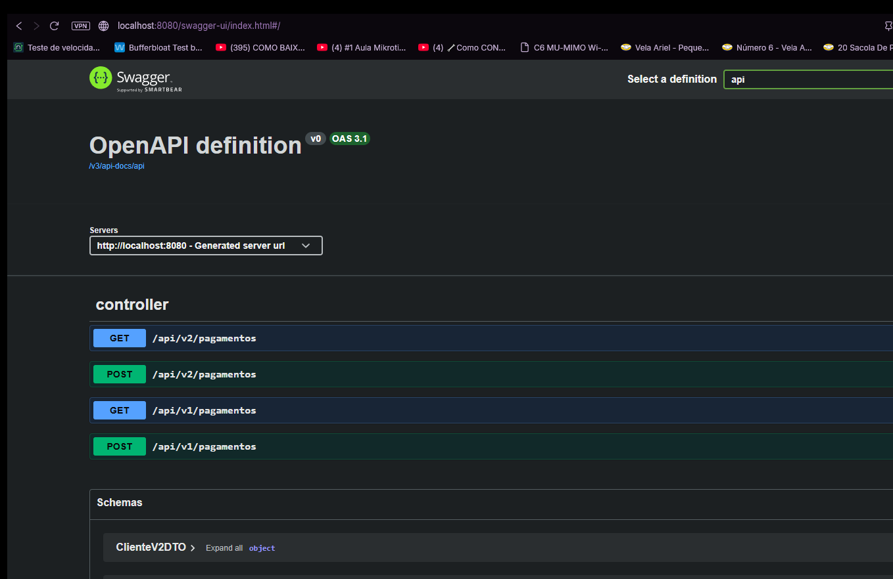
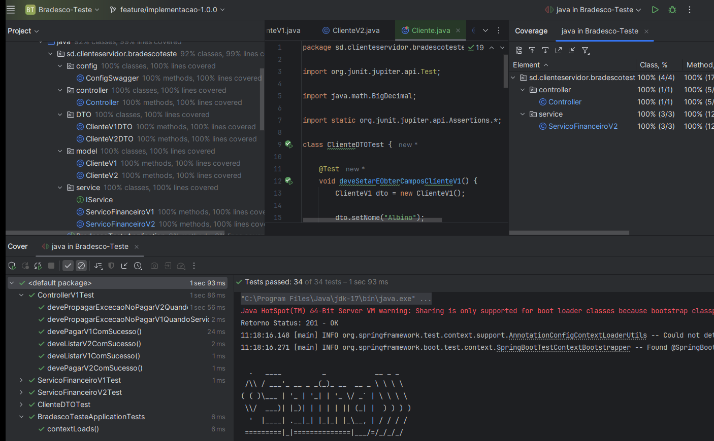

# Simulação de Versionamento API

Este projeto demonstra a utilização de Spring Boot com versionamento de API dentro do mesmo controller, aplicando boas práticas de arquitetura e técnicas avançadas de injeção de dependência.

🔑 Principais pontos:

- Versionamento de API: Implementação de múltiplas versões (v1, v2, etc.) em um único controller, garantindo compatibilidade retroativa e evolução contínua da aplicação sem quebra para clientes existentes.

- Uso de @Component e @Qualifier: Estratégia avançada para gerenciar diferentes implementações de serviços, permitindo que cada versão da API utilize sua própria lógica de negócio de forma desacoplada.

- Organização e escalabilidade: Estrutura pensada para facilitar manutenção e expansão, evitando duplicação de código e mantendo clareza na evolução das versões.

- Boas práticas REST: Endpoints bem definidos, seguindo convenções RESTful e mantendo consistência entre versões.

🚀 Benefícios da abordagem:

- Redução de complexidade ao centralizar o versionamento em um único controller.

- Flexibilidade para evoluir regras de negócio sem impactar versões anteriores.

- Facilita testes e documentação, já que todas as versões estão organizadas de forma coesa.

🔑 Fato Importante:

- Não tem relação com nenhuma empresa, é uma simples implementação sobre as apis do mercado que tem que se atualizar sobre a nova diretriz de cnpj alfanumerico, isso traz diversas formas, uma delas para manter a api funcional, é implementar um versionamento com injeção de dependência inteligente e dinâmico, essa Simulação simples foi feita, sem nenhuma regra específica.

- Fato se dá a título de teste e aprendizado contínuo. Experiência muito gratificante pois se colocar as orientações abaixo seu teste funcionará e chegará ao propósito final:  
    - V1 funcional como original;
    - V2 funcional como nova implementação;
    - ambas funcionam ao mesmo tempo, a manutenção do código fica visualmente fácil e prática para novas implementações;
    - No interior do projeto deixarei um arquivo com os dados testados, livre para qualquer teste pessoal sem finalidade lucrativa. 

🚀 Tecnologias utilizadas

- Java 17

- Spring Boot 3.5.3

- Spring Web (REST API)

- Spring Validation (Jakarta Bean Validation)

- Springdoc OpenAPI (Swagger UI)

- Versão: 2.8.15

- Maven

- Tomcat embarcado

- Arquitetura com Interface + @Component + @Qualifier

- Versionamento de API (V1 / V2)

- IDE: IntelliJ IDEA 2024.2.6 (Ultimate Edition)

🏗️ Arquitetura do projeto

- Controller injeta serviços via interface (IService)

- Implementações separadas por versão:

- @Component("servicoV1")

- @Component("servicoV2")

- Seleção explícita de implementação via @Qualifier

- Persistência em memória (sem banco de dados)

- DTOs distintos por versão:

- V1 → CNPJ numérico

- V2 → CNPJ String alfanumérico

🚀 Funcionamento no visual com Swagger
  
    - http://localhost:8080/swagger-ui/index.html#/
    - Relembrando, no interior do projeto tem .txt com body das requisições

🧪 Excelência em Testes, Confiabilidade e Governança de Código

- O projeto possui uma suíte de testes automatizados estruturada e rigorosa, cobrindo integralmente as jornadas V1 e V2, com validações consistentes de regras de negócio, fluxos positivos, cenários de erro e comportamento em exceções.
Os testes foram projetados para assegurar determinismo, isolamento e previsibilidade, reduzindo riscos de regressão e garantindo estabilidade contínua da aplicação.

- A estratégia de testes atende critérios de qualidade exigidos por pipelines de CI/CD, com foco em:

- Alta cobertura de código, incluindo caminhos críticos e validações defensivas

- Aderência às boas práticas recomendadas por ferramentas como SonarQube, evitando code smells, falhas de confiabilidade e riscos de manutenção

- Segregação clara de responsabilidades, validando controllers, serviços e modelos de forma independente

- Prontidão para auditorias técnicas, assegurando rastreabilidade, legibilidade e evolução segura do código ao longo do tempo

- Essa abordagem fortalece a governança do código-fonte e sustenta um ciclo de entrega contínua com qualidade mensurável, confiável e auditável.

🚀 Em Teste:  Rodar pipeline...

